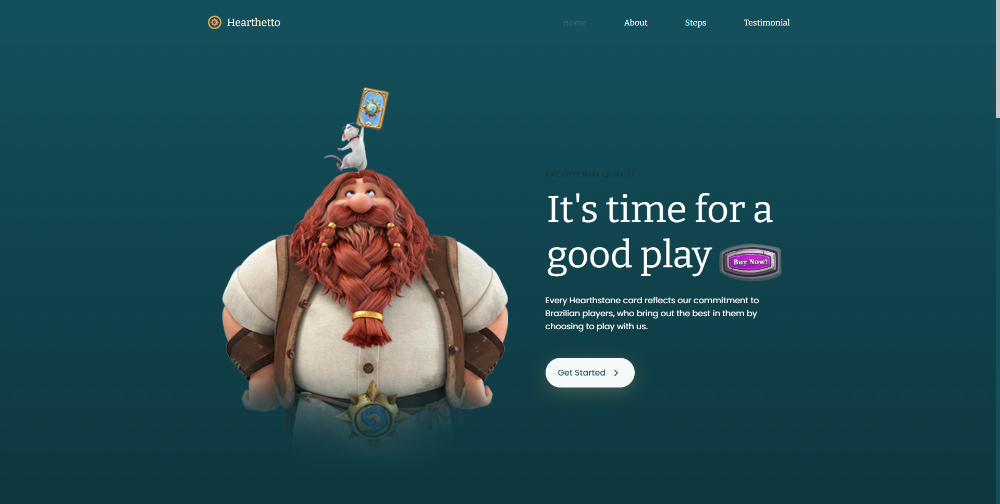
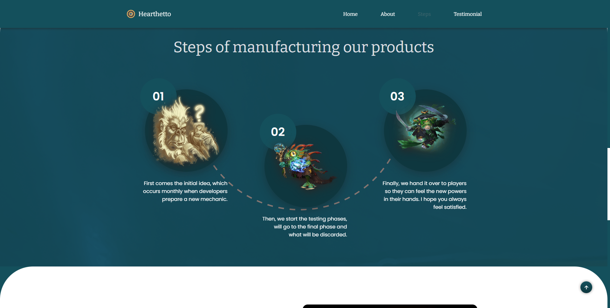
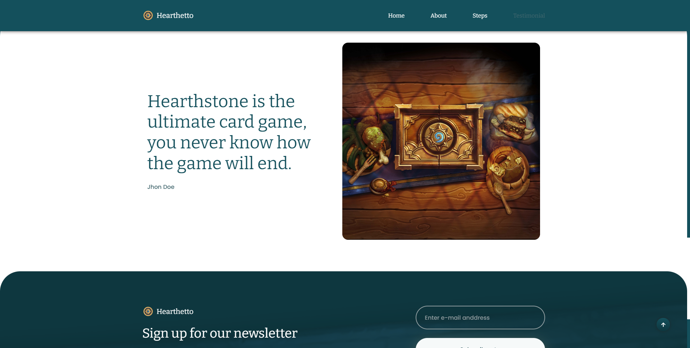
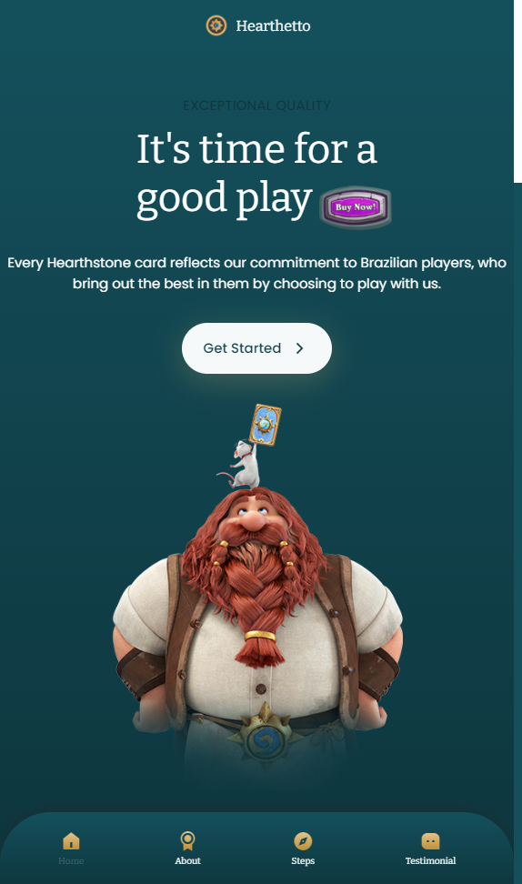
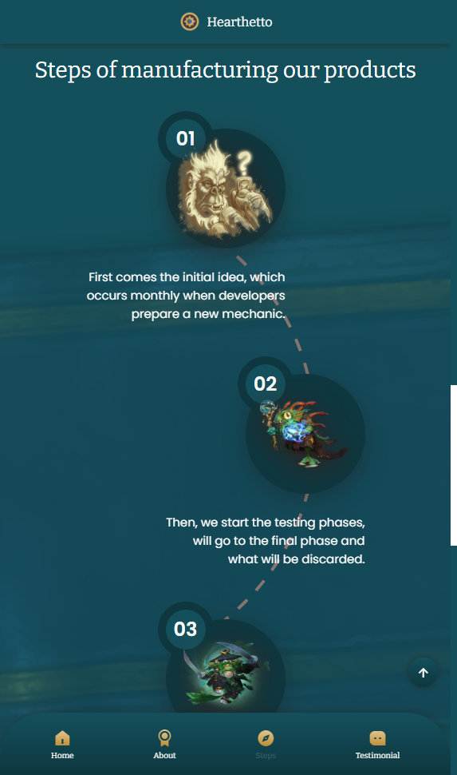
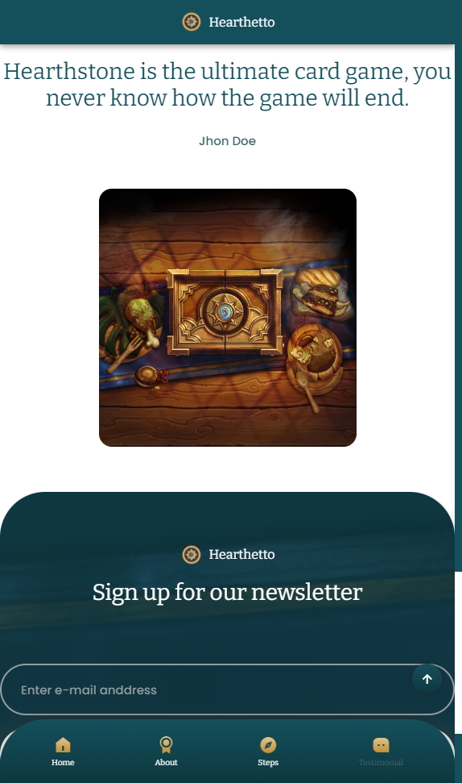

# Responsive Hearthstone:

Repositório para aprimorar algumas técnicas básicas de HTML, SCSS e JavaScript. Seu objetivo é construir um site sobre o jogo Hearthstone, para isso buscarei em vários projetos e vídeos para construir o meu. Devidamente irei referenciar cada uma das ideias e autores utilizados.

# Desenvolvimento contínuo:

Alguns ajustes podem vir, porém creio que esse projeto foi terminado. O qual será adicionado ao portfólio eventualmente.

### Screenshot

# Recursos úteis:

- [Responsive Coffee Website Design Using HTML CSS & JavaScript](https://www.youtube.com/watch?v=JFQAUjpyUpk)
- [Vhv.rs - Images](https://www.vhv.rs/somore/hearthstone/)
- [Favicon](https://favicon.io/emoji-favicons/robot)
- [ChatGPT](https://chat.openai.com/)

# Autor

- Github - [@fty57](https://github.com/fty57)

# Conhecimentos

Ter essa oportunidade de utilizar um pouco do SCSS foi bem interessante, ele consegue aninhar bem as classes de um modo que faz bastante sentido e torna bem mais prático, admito que tive momentos que encontrei desafios e dei um pulo de volta no CSS básico, visto que o SCSS também entende ambos. Pretendo me dedicar mais e poder aprender um pouco mais, além de querer utilizar mais as variáveis.
